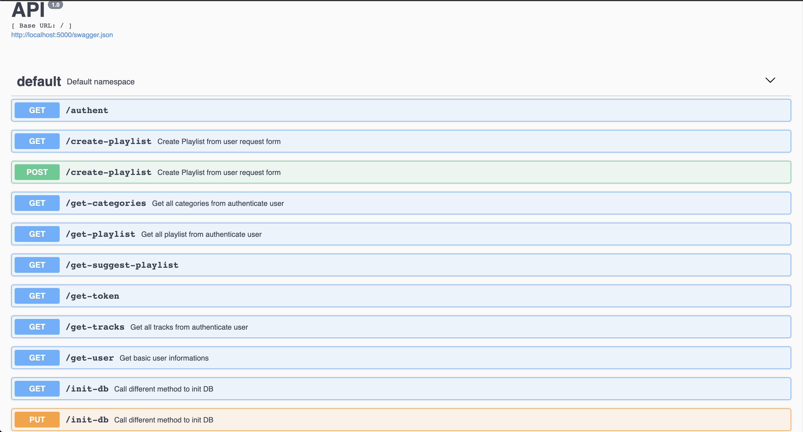

## Prerequisites

-   Python 3.7
-   Psql 12.2

## Documentation
Flast restfull is used here to allow progressive documentation as development proceeds


## How to run it
-   `pip install -r requirements.txt`
-   In the end of flask/app.py file change host to localhost
-   Then run the following command:
-   `python3 -m app.app`
-   The API will run on localhost:5000

If it's your first time you have to create the DB
```
$ psql
$ create database YOURDB;
$ CREATE DATABASE
$ \q
```
And then change config.py to add DATABASE URI